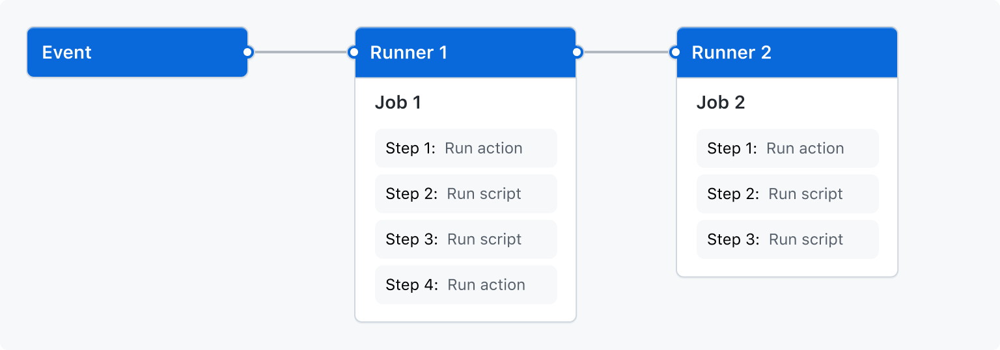

# Learn GitHub Actions

### The components of GitHub Actions 

You can configure a GitHub Actions _workflow_ to be triggered when an _event_ occurs in your repository, such as a pull request being opened or an issue being created. Your workflow contains one or more _jobs_ which can run in sequential order or in parallel. Each job will run inside its own virtual machine _runner_, or inside a container, and has one or more _steps_ that either run a script that you define or run an _action_, which is a reusable extension that can simplify your workflow.

#### Workflows 

A workflow is a configurable automated process that will run one or more jobs. Workflows are defined by a YAML file checked in to your repository and will run when triggered by an event in your repository, or they can be triggered manually, or at a defined schedule.

#### Events 

An event is a specific activity in a repository that triggers a workflow run. For example, activity can originate from GitHub when someone creates a pull request, opens an issue, or pushes a commit to a repository. You can also trigger a workflow run on a schedule, by [posting to a REST API](https://docs.github.com/en/rest/reference/repos#create-a-repository-dispatch-event), or manually.

#### Jobs 

A job is a set of _steps_ in a workflow that execute on the same runner. Each step is either a shell script that will be executed, or an _action_ that will be run. Steps are executed in order and are dependent on each other. Since each step is executed on the same runner, you can share data from one step to another. For example, you can have a step that builds your application followed by a step that tests the application that was built.

#### Actions 

An _action_ is a custom application for the GitHub Actions platform that performs a complex but frequently repeated task. Use an action to help reduce the amount of repetitive code that you write in your workflow files. An action can pull your git repository from GitHub, set up the correct toolchain for your build environment, or set up the authentication to your cloud provider.\
E.g.: [https://github.com/actions/checkout](https://github.com/actions/checkout)

#### Runners 

A runner is a server that runs your workflows when they're triggered. Each runner can run a single job at a time. GitHub provides Ubuntu Linux, Microsoft Windows, and macOS runners to run your workflows; each workflow run executes in a fresh, newly-provisioned virtual machine. If you need a different operating system or require a specific hardware configuration, you can host your own runners.&#x20;

#### Full Documentation

[https://docs.github.com/en/actions/learn-github-actions](https://docs.github.com/en/actions/learn-github-actions)

